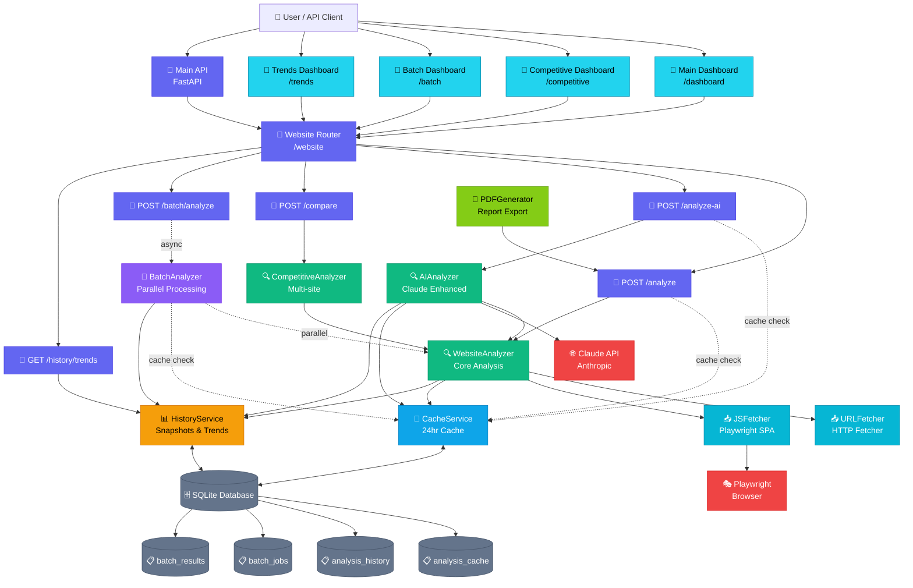

# System Architecture

## Overview

The Principal Narrative system is a multi-layered application for analyzing website narratives with AI-enhanced insights, batch processing, and historical tracking.

## Architecture Diagram



## Layer Breakdown

### 1. Client Layer
- **Users**: End users accessing dashboards or making direct API calls
- **4 Dashboards**: Interactive UIs for different analysis types

### 2. API Layer (FastAPI)
- **Main API** (`src/main.py`): Application entry point
- **Website Router** (`src/routes/website_routes.py`): Groups all website analysis endpoints
- **5 Key Endpoints**:
  - `POST /analyze` - Standard narrative analysis
  - `POST /analyze-ai` - AI-enhanced analysis with Claude
  - `POST /compare` - Competitive analysis (2-5 sites)
  - `POST /batch/analyze` - Batch URL processing
  - `GET /history/trends` - Historical trend analysis

### 3. Service Layer

#### Analyzers
- **WebsiteAnalyzer** (`src/analyzer/website_analyzer.py`)
  - Core narrative extraction engine
  - Claims, proof, personas detection
  - Foundation for all analysis types

- **AIAnalyzer** (`src/services/ai_narrative_analyzer.py`)
  - AI-enhanced analysis using Claude API
  - Strength scoring, gap detection
  - Tone analysis, value prop scoring

- **CompetitiveAnalyzer** (`src/services/competitive_analyzer.py`)
  - Multi-site comparison
  - Gap identification
  - Competitive insights

- **BatchAnalyzer** (`src/services/batch_analyzer.py`)
  - Parallel URL processing (5-10 concurrent)
  - Job tracking and progress monitoring
  - CSV export capabilities

#### Supporting Services
- **CacheService** (`src/services/cache_service.py`)
  - 24-hour automatic caching
  - SHA256-based cache keys
  - Reduces API costs by 60-80%

- **HistoryService** (`src/services/history_service.py`)
  - Permanent snapshot storage
  - Automatic trend detection
  - Insight generation

- **URLFetcher** (`src/services/url_fetcher.py`)
  - HTTP website fetching
  - Multi-page crawling

- **JSFetcher** (`src/services/js_fetcher.py`)
  - JavaScript rendering for SPAs
  - Playwright integration

- **PDFGenerator** (`src/services/pdf_generator.py`)
  - Professional PDF reports
  - Chart generation with matplotlib

### 4. Data Layer (SQLite)

**Database**: `data/narrative_analysis.db` (`src/database/schema.py`)

**Tables**:
- `analysis_cache` - 24-hour cached results (expires_at, url_hash, result_json)
- `analysis_history` - Historical snapshots (snapshot_date, metrics, scores)
- `batch_jobs` - Batch job tracking (status, progress, timestamps)
- `batch_results` - Individual batch results (url, status, metrics)

### 5. External Services

- **Claude API** (Anthropic)
  - Model: `claude-sonnet-4-20250514`
  - AI-enhanced narrative analysis
  - Smart claim extraction and insights

- **Playwright**
  - Headless browser automation
  - JavaScript rendering for SPAs
  - Support for React, Vue, Angular

## Data Flow Examples

### Standard Analysis Flow
```
User → Dashboard → POST /analyze
  → Check Cache (CacheService)
    → [Cache Hit] Return cached result (< 1s)
    → [Cache Miss] Continue ↓
  → WebsiteAnalyzer
    → URLFetcher/JSFetcher (fetch content)
    → Extract claims, proof, personas
    → Calculate scores
  → Save to Cache (24hr expiration)
  → Save to History (permanent)
  → Return results
```

### AI-Enhanced Analysis Flow
```
User → Dashboard → POST /analyze-ai
  → Check Cache (CacheService)
    → [Cache Hit] Return cached result
    → [Cache Miss] Continue ↓
  → AIAnalyzer
    → WebsiteAnalyzer (base analysis)
    → Claude API (AI enhancement)
      - Strength scoring (0-100)
      - Gap detection
      - Tone analysis
      - Recommendations
  → Save to Cache
  → Save to History
  → Return AI-enhanced results
```

### Batch Analysis Flow
```
User → Batch Dashboard → POST /batch/analyze
  → BatchAnalyzer (async background job)
    → Create job_id
    → For each URL (parallel, max 5-10 concurrent):
      → Check Cache (skip if cached)
      → WebsiteAnalyzer
      → Save to History
      → Update job progress
  → Poll GET /batch/status/{job_id} (real-time progress)
  → GET /batch/results/{job_id} (when complete)
  → GET /batch/export-csv/{job_id} (download CSV)
```

### Historical Trends Flow
```
User → Trends Dashboard → GET /history/trends/{url}
  → HistoryService
    → Query analysis_history table
    → Get snapshots for last N days
    → Calculate trends (increasing/decreasing/stable)
    → Generate insights
      - "Claims increased by 5"
      - "Score dropped by 12 points"
  → Return trend analysis with charts
```

## Technology Stack

### Backend
- **Framework**: FastAPI (Python 3.11+)
- **Database**: SQLite with connection pooling
- **Async**: asyncio for concurrent processing
- **AI**: Anthropic Claude API
- **Browser**: Playwright for JavaScript rendering

### Frontend
- **Dashboards**: Vanilla JavaScript + HTML/CSS
- **Charts**: Chart.js for visualizations
- **Styling**: Custom CSS with gradients and modern UI

### Data Processing
- **HTML Parsing**: BeautifulSoup4
- **PDF Generation**: WeasyPrint + matplotlib
- **Caching**: SHA256 hashing + SQLite
- **Serialization**: JSON for results, dataclasses for type safety

## Performance Characteristics

### Response Times
- **Cached Analysis**: < 1 second
- **Fresh Standard Analysis**: 5-10 seconds (depends on site size)
- **AI-Enhanced Analysis**: 20-30 seconds (includes Claude API call)
- **Batch Analysis**: 6 seconds per URL average (with 50% cache hit rate)

### Scalability
- **Concurrent Batch Jobs**: 5-10 URLs simultaneously
- **Cache Hit Rate**: 60-80% typical
- **Database Size**: ~5KB per snapshot, ~50KB per cached result

### Cost Optimization
- **Caching**: Reduces API calls by 60-80%
- **Batch Processing**: Amortizes overhead across multiple URLs
- **Historical Storage**: Unlimited snapshots for trend analysis

## Security Considerations

- API key protection (ANTHROPIC_API_KEY in environment)
- SQLite injection prevention (parameterized queries)
- URL validation before fetching
- Temporary file cleanup after analysis
- No user authentication (designed for internal use)

## Monitoring & Observability

- **Logging**: Structured logging to `logs/narrative-api.log`
- **Health Checks**: `GET /website/health` with cache stats
- **Progress Tracking**: Real-time batch job status
- **Error Handling**: Comprehensive try-catch with cleanup

## Future Enhancements

Potential additions to the architecture:
- **Redis Cache**: Replace SQLite cache for better performance
- **PostgreSQL**: Production-grade database for multi-tenant
- **Message Queue**: RabbitMQ/Celery for better batch processing
- **WebSocket**: Real-time progress updates
- **Authentication**: OAuth2/JWT for multi-user access
- **Rate Limiting**: Protect external API usage
- **Monitoring**: Prometheus + Grafana dashboards

---

**Last Updated**: December 2024
**Version**: 2.0 (with caching, history, and batch features)
