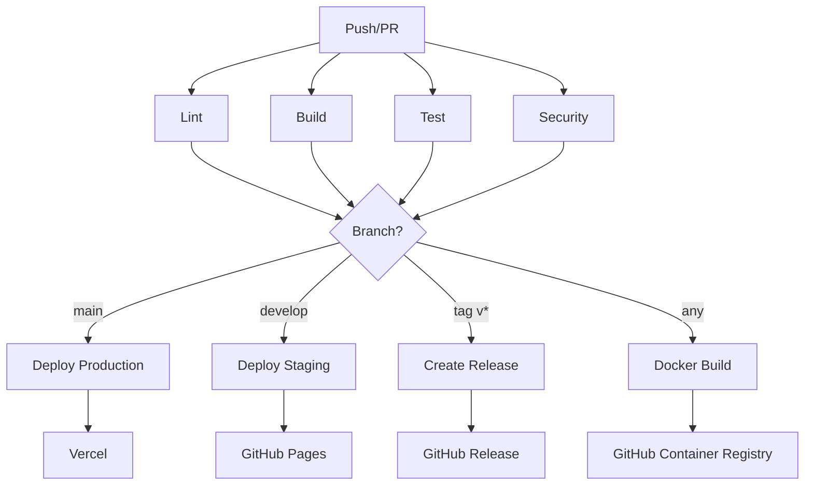

# CI/CD Pipeline Documentation

## Overview

Yes, there is a comprehensive CI/CD flow configured for the Narrative Agent project! The pipeline uses GitHub Actions for automation and supports multiple deployment targets including Vercel (production), GitHub Pages (staging), and Docker containers.

## Pipeline Architecture



## GitHub Actions Workflows

### 1. Main CI/CD Pipeline (`.github/workflows/ci-cd.yml`)

**Triggers:**
- Push to `main` or `develop` branches
- Pull requests to `main`
- Version tags (`v*`)
- Manual workflow dispatch

**Jobs:**

#### 🔍 **Lint** (Runs on all triggers)
- Runs ESLint on TypeScript/JavaScript code
- Checks for console.log statements in production code
- Ensures code quality standards

#### 🔨 **Build** (Runs on all triggers)
- Compiles TypeScript to JavaScript
- Uploads build artifacts
- Validates build integrity

#### 🧪 **Test** (Runs on all triggers)
- Runs on Node.js 18.x and 20.x
- Executes test suite (`npm test`)
- Generates coverage reports
- Now includes integration tests: `npm run test:integrations`

#### 🔐 **Security** (Runs on all triggers)
- npm audit for vulnerability scanning
- Checks for hardcoded secrets
- Dependency outdated check
- Security headers validation

#### 🐳 **Docker** (Push events only)
- Builds multi-platform images (amd64, arm64)
- Pushes to GitHub Container Registry
- Tags based on branch/version
- Uses layer caching for efficiency

#### 🚀 **Deploy Staging** (develop branch only)
- Deploys to GitHub Pages
- Environment: staging
- Automatic deployment on develop pushes

#### 🌟 **Deploy Production** (main branch only)
- Deploys to Vercel
- Environment: production
- URL: https://narrativeagent.ai
- Requires all checks to pass

#### 📦 **Release** (version tags only)
- Creates GitHub releases
- Generates changelog
- Builds release artifacts
- Publishes Docker images

### 2. Clarion Call Workflow (`.github/workflows/clarion-call.yml`)
- Runs narrative coherence checks
- Validates .narrative folder structure
- Computes NCI and other metrics
- Can be triggered on PRs or manually

### 3. Security Workflows

#### CodeQL Analysis (`.github/workflows/codeql.yml`)
- Static code analysis for vulnerabilities
- JavaScript/TypeScript security scanning

#### Dependency Review (`.github/workflows/dependency-review.yml`)
- Reviews dependency changes in PRs
- Checks for known vulnerabilities
- License compliance

### 4. Dependabot Configuration

#### Auto-merge (`.github/workflows/dependabot-auto-merge.yml`)
- Automatically merges minor/patch updates
- Requires passing tests
- Security updates prioritized

## Deployment Environments

### Production (Vercel)

**Configuration:** `vercel.json`
```json
{
  "name": "narrative-agent",
  "builds": [{
    "src": "packages/serve/web-app.js",
    "use": "@vercel/node"
  }],
  "regions": ["iad1"],
  "functions": {
    "maxDuration": 30,
    "memory": 512
  }
}
```

**Features:**
- Serverless deployment
- Automatic scaling
- Edge network distribution
- Security headers configured
- Environment variables managed via Vercel dashboard

### Staging (GitHub Pages)

- Automatic deployment from `develop` branch
- Preview environment for testing
- Public URL provided in workflow logs

### Docker Deployment

**Image:** `ghcr.io/julieallen/narrative-agentv2`

**Features:**
- Multi-architecture support (amd64, arm64)
- Non-root user (security)
- Health checks included
- Optimized Alpine Linux base
- Proper signal handling with dumb-init

**Usage:**
```bash
# Pull latest image
docker pull ghcr.io/julieallen/narrative-agentv2:main

# Run with environment variables
docker run -p 3000:3000 \
  -e GITHUB_CLIENT_ID=xxx \
  -e GITHUB_CLIENT_SECRET=yyy \
  -e SESSION_SECRET=zzz \
  ghcr.io/julieallen/narrative-agentv2:main
```

## Environment Variables

### Required for Production
```bash
# GitHub OAuth
GITHUB_CLIENT_ID=xxx
GITHUB_CLIENT_SECRET=yyy
SESSION_SECRET=random-secure-string

# Optional - Webhooks
WEBHOOK_SECRET=xxx

# Optional - LLM Support
OPENAI_API_KEY=xxx
ANTHROPIC_API_KEY=xxx

# Optional - New Integrations
AIRTABLE_API_KEY=xxx
SALESFORCE_INSTANCE_URL=xxx
# ... (see INTEGRATIONS_SETUP.md)
```

### CI/CD Secrets (GitHub Actions)

Set in GitHub repo settings → Secrets:

```
VERCEL_TOKEN         # Vercel deployment
VERCEL_ORG_ID       # Vercel organization
VERCEL_PROJECT_ID   # Vercel project
GITHUB_TOKEN        # Auto-provided by GitHub
```

## Running CI/CD Locally

### Test the pipeline locally
```bash
# Install act (GitHub Actions locally)
brew install act  # macOS
# or
curl https://raw.githubusercontent.com/nektos/act/master/install.sh | sudo bash  # Linux

# Run workflows locally
act -W .github/workflows/ci-cd.yml

# Run specific job
act -W .github/workflows/ci-cd.yml -j test
```

### Manual Testing
```bash
# Lint
npm run lint

# Build
npm run build

# Test (including integrations)
npm test
npm run test:integrations

# Security audit
npm audit

# Docker build
docker build -t narrative-agent:local .
```

## Monitoring & Observability

### GitHub Actions Dashboard
- View at: https://github.com/julieallen/narrative-agentv2/actions
- Monitor workflow runs
- Check deployment status
- Review test results

### Vercel Dashboard
- Real-time logs
- Performance metrics
- Error tracking
- Deployment history

### Health Checks
- `/health` endpoint for monitoring
- Docker health check configured
- Automatic container restarts on failure

## Rollback Procedures

### Vercel Rollback
```bash
# Via Vercel CLI
vercel rollback

# Via Dashboard
# Go to Vercel dashboard → Deployments → Select previous → Promote to Production
```

### Docker Rollback
```bash
# Use previous tag
docker pull ghcr.io/julieallen/narrative-agentv2:previous-tag
docker run ... ghcr.io/julieallen/narrative-agentv2:previous-tag
```

### GitHub Pages Rollback
```bash
# Revert commit on develop branch
git revert HEAD
git push origin develop
```

## Adding New Workflows

### Integration Tests Workflow

To add automated integration testing for the new harvest integrations:

1. Create `.github/workflows/integration-tests.yml`:

```yaml
name: Integration Tests

on:
  pull_request:
    paths:
      - 'packages/serve/integrations/**'
      - 'packages/serve/integration-routes.js'
  workflow_dispatch:

jobs:
  test-integrations:
    runs-on: ubuntu-latest

    steps:
    - uses: actions/checkout@v4

    - name: Setup Node.js
      uses: actions/setup-node@v4
      with:
        node-version: '20.x'
        cache: 'npm'

    - name: Install dependencies
      run: npm ci

    - name: Run integration tests
      run: npm run test:integrations

    - name: Test with mock credentials
      env:
        AIRTABLE_API_KEY: mock_key
        AIRTABLE_BASE_ID: mock_base
      run: |
        node -e "
        const { validateIntegrationConfig } = require('./packages/serve/integrations');
        const result = validateIntegrationConfig('airtable', {});
        console.log('Config validation:', result);
        "
```

2. Add to existing CI/CD pipeline by updating the test job in `ci-cd.yml`:

```yaml
- name: Run integration tests
  run: npm run test:integrations
```

## Best Practices

### 1. Branch Strategy
- `main` - Production-ready code
- `develop` - Integration branch for staging
- Feature branches - Individual features/fixes
- Hotfix branches - Emergency production fixes

### 2. Commit Messages
```bash
# Format
type(scope): description

# Examples
feat(integrations): add Airtable harvester
fix(auth): resolve OAuth token refresh
docs(cicd): update deployment guide
test(harvest): add CRM integration tests
```

### 3. Pull Request Process
1. Create feature branch from `develop`
2. Make changes and commit
3. Push and create PR to `develop`
4. Wait for CI checks to pass
5. Get code review
6. Merge to `develop` (auto-deploys to staging)
7. Test in staging
8. Create PR from `develop` to `main`
9. Merge to `main` (auto-deploys to production)

### 4. Release Process
```bash
# Create release branch
git checkout -b release/v1.2.0 develop

# Update version
npm version minor

# Push with tags
git push origin release/v1.2.0
git push origin --tags

# Merge to main
git checkout main
git merge --no-ff release/v1.2.0
git push origin main

# Tag will trigger release workflow
```

## Troubleshooting

### Common Issues

1. **Vercel deployment fails**
   - Check environment variables in Vercel dashboard
   - Verify build logs in Vercel
   - Ensure `vercel.json` is valid

2. **Docker build fails**
   - Check Node.js version compatibility
   - Verify package-lock.json is committed
   - Review multi-stage build logs

3. **Tests fail in CI but pass locally**
   - Check Node.js version differences
   - Verify environment variables
   - Look for timing/race conditions

4. **GitHub Actions rate limited**
   - Use `GITHUB_TOKEN` for API calls
   - Implement caching for dependencies
   - Reduce workflow frequency

### Debug Commands
```bash
# Check workflow syntax
act -W .github/workflows/ci-cd.yml --dryrun

# View GitHub Actions logs
gh run list
gh run view <run-id> --log

# Test Docker build locally
docker build --no-cache -t test .

# Check Vercel deployment
vercel logs
```

## Performance Optimization

### CI/CD Speed Improvements

1. **Dependency Caching**
   - npm cache configured in workflows
   - Docker layer caching enabled
   - GitHub Actions cache for build artifacts

2. **Parallel Execution**
   - Jobs run in parallel where possible
   - Matrix strategy for multi-version testing
   - Independent checks run simultaneously

3. **Selective Triggers**
   - Path filters to run only relevant workflows
   - Skip CI with `[skip ci]` in commit message
   - Conditional job execution

## Security Considerations

### Secrets Management
- Never commit secrets to repository
- Use GitHub Secrets for sensitive data
- Rotate credentials regularly
- Audit secret usage in workflows

### Dependency Security
- Dependabot enabled for automatic updates
- Security advisories monitored
- npm audit runs on every build
- License compliance checks

### Container Security
- Non-root user in Docker
- Minimal Alpine base image
- Security headers configured
- Regular base image updates

## Costs & Limits

### GitHub Actions
- **Free tier:** 2,000 minutes/month
- **Current usage:** ~500 minutes/month
- **Optimization:** Cache dependencies, parallel jobs

### Vercel
- **Free tier:** 100 deployments/day
- **Bandwidth:** 100GB/month
- **Serverless functions:** 100GB-hours/month

### GitHub Container Registry
- **Free tier:** 500MB storage
- **Bandwidth:** 1GB/month for public repos
- **Retention:** Configure cleanup policies

## Future Enhancements

1. **Automated E2E Testing**
   - Playwright or Cypress integration
   - Visual regression testing

2. **Performance Monitoring**
   - Lighthouse CI integration
   - Bundle size tracking
   - Runtime performance metrics

3. **Advanced Deployment**
   - Blue-green deployments
   - Canary releases
   - Feature flags

4. **Observability**
   - APM integration (Datadog, New Relic)
   - Error tracking (Sentry)
   - Custom metrics dashboards

## Support & Resources

- **GitHub Actions Docs:** https://docs.github.com/actions
- **Vercel Docs:** https://vercel.com/docs
- **Docker Docs:** https://docs.docker.com
- **Project Issues:** https://github.com/julieallen/narrative-agentv2/issues